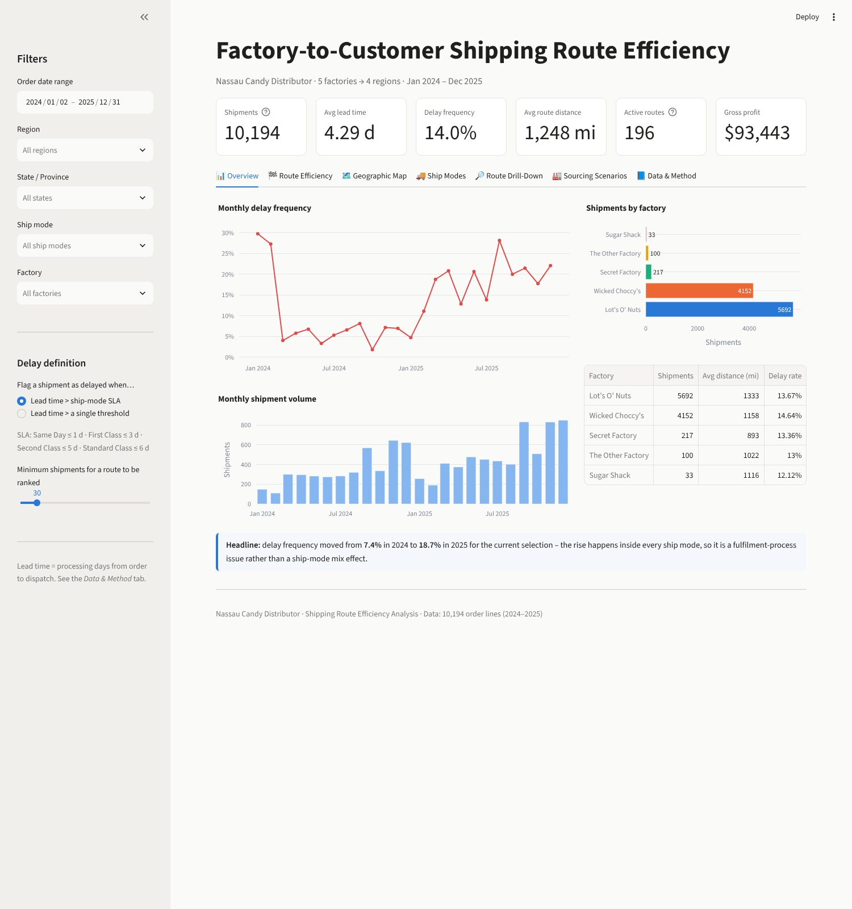
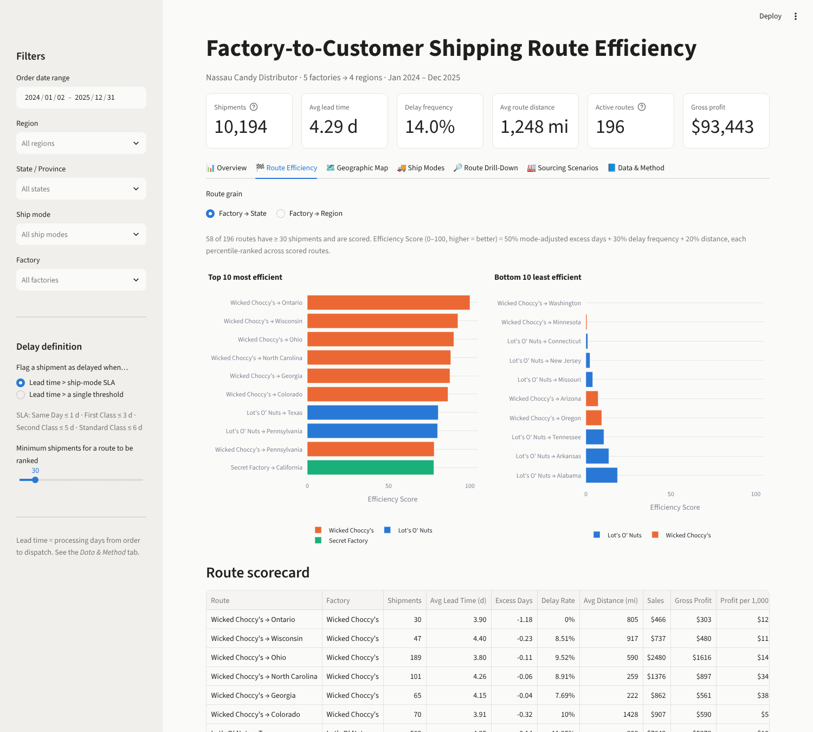
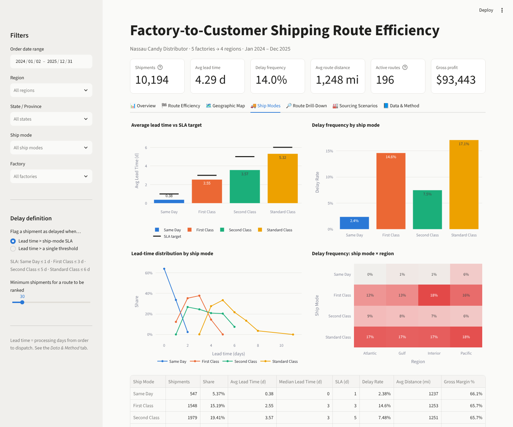
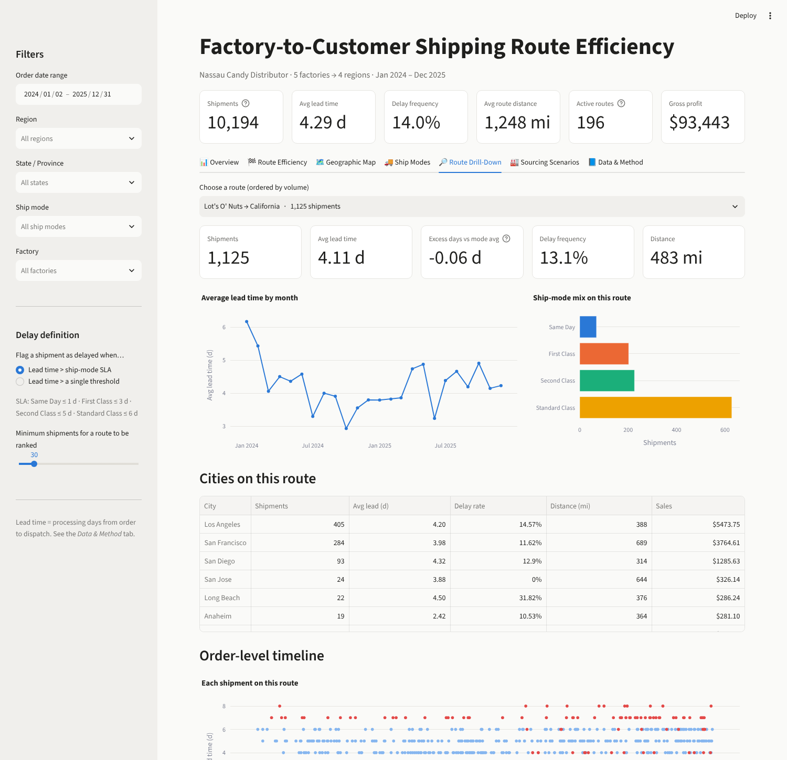
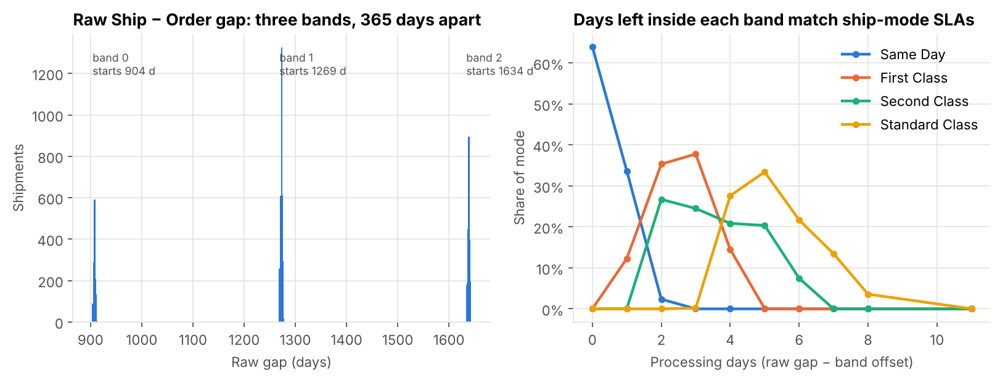

# 🚚 Factory-to-Customer Shipping Route Efficiency Analysis — Nassau Candy Distributor


An end-to-end logistics analytics project that measures how efficiently Nassau Candy's five factories serve
customers across the US and Canada, pinpoints slow routes and geographic bottlenecks, compares ship modes, and
simulates how re-assigning production could cut shipping distance — delivered as a **reproducible Python
pipeline, an analysis notebook, a research report and an interactive Streamlit dashboard**.

> **Live dashboard:** _add your Streamlit Community Cloud link here after deploying (see [Deploy](#-deploy-to-streamlit-community-cloud))_

---

## 📑 Contents
1. [Business problem](#-business-problem)
2. [Key findings](#-key-findings)
3. [Recommendations](#-recommendations)
4. [Dashboard](#-dashboard)
5. [Data & the lead-time data-quality finding](#-data--the-lead-time-data-quality-finding)
6. [KPIs & methodology](#-kpis--methodology)
7. [Repository structure](#-repository-structure)
8. [How to run](#-how-to-run)
9. [Deliverables](#-deliverables)
10. [Limitations](#-limitations)

---

## 🎯 Business problem
Nassau Candy makes 15 products in 5 factories and ships them by 4 ship modes to customers in 4 regions.
Management had no route-level view of logistics performance and could not answer:

* Which **factory → customer routes** are fast and reliable, and which are not?
* Where are the **geographic bottlenecks**?
* How do **ship modes** compare on speed and reliability?
* Is the **factory network** well placed relative to where customers actually are?

## 💡 Key findings

| # | Finding | Evidence |
|---|---|---|
| 1 | **Delays come from fulfilment, not distance.** | Distance vs mode-adjusted lead time: Spearman ρ = 0.007 (p = 0.50). Region and factory are not significant once ship mode is controlled for. |
| 2 | **Service deteriorated sharply in 2025.** | SLA breach rate **7.4 % (2024) → 18.7 % (2025)**, rising inside *every* ship mode while the mode mix stayed constant. |
| 3 | **Ship mode sets the speed.** | Same Day 0.4 d · First 2.5 d · Second 3.6 d · Standard 5.3 d. Standard Class = 60 % of volume and the highest breach rate (17.1 %). |
| 4 | **Premium service is unreliable.** | **14.6 %** of First Class shipments miss their 3-day SLA. |
| 5 | **Clear geographic bottlenecks.** | Minnesota, Missouri, Utah, Oklahoma, Indiana, Washington, Illinois are significantly slower than average (95 % CI above zero). |
| 6 | **The factory network is "crossed".** | Lot's O' Nuts (Arizona) handles 56 % of shipments but ships the furthest (1,333 mi avg) — largely to the East Coast — while Wicked Choccy's (Georgia) ships heavily to the West Coast. |
| 7 | **Big distance savings are available.** | Routing each chocolate order to the *nearer* of the two chocolate plants cuts chocolate unit-miles by **49 %** (56 % if Secret Factory, Illinois, is added). |
| 8 | **The raw ship dates are shifted.** | Raw Ship − Order gaps are 904–1,642 days; corrected before analysis (see below). |

**Best routes:** short regional lanes — Wicked Choccy's → Wisconsin / Ohio / North Carolina / Georgia, Lot's O' Nuts → Texas.
**Worst routes:** Wicked Choccy's → Washington and → Minnesota (36 % SLA breach), Lot's O' Nuts → Connecticut / New Jersey / Missouri.

## ✅ Recommendations
1. **Root-cause the 2025 dispatch slowdown** (staffing, carrier pick-up windows, cut-off times) and add fulfilment capacity.
2. **Dual-source Wonka Bars** from the Arizona and Georgia plants with nearest-plant routing (−49 % chocolate unit-miles).
3. **Protect First Class** with a dedicated pick lane or earlier cut-off.
4. **Targeted review of bottleneck states** (MN, MO, UT, OK, IN, WA, IL).
5. **Fix the date-shift defect** in the order/ship-date export and start capturing freight cost and delivery date.

## 📊 Dashboard
`streamlit run app.py` — seven tabs driven by one set of sidebar filters:
**order-date range · region · state/province · ship mode · factory · delay definition (ship-mode SLA *or* a single lead-time threshold slider) · minimum route volume**.

| Tab | What it shows |
|---|---|
| **Overview** | Headline KPIs with deltas vs the full network, monthly delay trend & volume, factory summary |
| **Route Efficiency** | Top/bottom-10 route charts and a sortable scorecard (factory→state or factory→region) with CSV export |
| **Geographic Map** | US choropleth (delay rate, lead time, excess days, volume, distance), factory locations, factory→state route lines, regional bottlenecks and statistically slow states |
| **Ship Modes** | Lead time vs SLA, delay rate, lead-time distributions, ship mode × region heatmap |
| **Route Drill-Down** | Per-route KPIs, monthly trend, ship-mode mix, city table, order-level timeline, CSV export |
| **Sourcing Scenarios** | Interactive nearest-plant simulation + single-factory relocation check for every product |
| **Data & Method** | Evidence for the date-shift correction and all KPI definitions |

| Overview | Route efficiency |
|---|---|
|  |  |
| **Ship modes** | **Route drill-down** |
|  |  |

## 🧹 Data & the lead-time data-quality finding
**Source:** `data/raw/Nassau_Candy_Distributor.csv` — 10,194 order lines × 18 fields (Jan 2024 – Dec 2025).
Factory coordinates and the product → factory mapping from the project brief are in `src/config.py`
(and exported to `data/reference/`).

| Check | Result | Action |
|---|---|---|
| Missing values / duplicates | 0 / 0 | – |
| `Sales − Cost = Gross Profit` | holds on every row | financials trusted |
| 4-digit US ZIP codes | 449 rows (leading zero lost) | left-padded to 5 digits |
| Product → factory mapping | 15 / 15 products | factory + coordinates joined |
| Geocoding | 100 % (US ZIP centroid, Canadian city centroid) | haversine distance computed |
| **Ship Date − Order Date** | **904 – 1,642 days** | **date-shift corrected** |



The raw gap falls into three narrow bands starting at 904, 1,269 and 1,634 days — exactly **365 days apart**.
Inside each band the leftover days follow the ship-mode hierarchy perfectly (Same Day 0–2, First 1–4,
Second 2–6, Standard 3–8 days). That structure could not survive if the whole gap were noise, so the leftover
is the real **order-processing lead time** and the band offset is a year-level shift introduced in the export:

```python
lead_time_days = (raw_gap_days - 904) % 365      # src/data_prep.py
```

The raw value is kept (`raw_lead_time_days`) for transparency.

## 📐 KPIs & methodology

| KPI | Definition |
|---|---|
| **Shipping lead time** | processing days from order to dispatch (date-shift removed) |
| **Average lead time** | mean lead time per route / state / region / ship mode |
| **Route volume** | number of shipments (order lines) on a route |
| **Delay frequency** | share of shipments with lead time above the SLA for their ship mode — Same Day ≤ 1 d, First ≤ 3 d, Second ≤ 5 d, Standard ≤ 6 d (≈ each mode's 75th percentile) |
| **Excess days** | lead time − network average for the same ship mode (removes ship-mode mix so routes compare fairly) |
| **Route Efficiency Score** | 0–100, higher = better: **50 %** excess days + **30 %** delay frequency + **20 %** distance, each percentile-ranked across routes with ≥ 30 shipments, rescaled so best = 100, worst = 0 |
| **Distance** | great-circle (haversine) miles, factory → customer |

**Statistics used:** Kruskal–Wallis tests on excess days by region, factory and state; 95 % confidence intervals
per state; Spearman correlation between distance and excess days; unit-weighted distance simulations for
production re-assignment.

## 🗂 Repository structure
```
nassau-candy-shipping-route-efficiency/
├── app.py                         # Streamlit dashboard (7 tabs)
├── requirements.txt
├── .streamlit/config.toml         # dashboard theme
├── src/
│   ├── config.py                  # factories, product→factory map, SLA targets, paths
│   ├── data_prep.py               # cleaning, geocoding, distance, lead-time correction
│   └── metrics.py                 # KPI, route-score, bottleneck and scenario functions
├── data/
│   ├── raw/                       # original CSV (unchanged)
│   ├── processed/                 # shipments_clean.csv (analysis-ready)
│   └── reference/                 # factories, product map, SLA table
├── notebooks/
│   └── 01_shipping_route_efficiency_analysis.ipynb   # full analysis, executed
├── reports/
│   ├── Nassau_Candy_Route_Efficiency_Research_Report.pdf
│   ├── Nassau_Candy_Route_Efficiency_Executive_Summary.pdf
│   ├── build_report.py            # regenerates both PDFs from the data
│   └── figures/                   # static charts used in the report
└── docs/screenshots/              # dashboard screenshots
```
The notebook, the PDFs and the dashboard all import the same `src/` functions, so every number is defined once.

## ▶ How to run
```bash
git clone https://github.com/<your-username>/nassau-candy-shipping-route-efficiency.git
cd nassau-candy-shipping-route-efficiency
python -m venv .venv && source .venv/bin/activate      # Windows: .venv\Scripts\activate
pip install -r requirements.txt

python -m src.data_prep            # 1. rebuild data/processed/shipments_clean.csv
streamlit run app.py               # 2. launch the dashboard  → http://localhost:8501
python -m reports.build_report     # 3. (optional) regenerate the PDF reports
```
Open `notebooks/01_shipping_route_efficiency_analysis.ipynb` to follow the analysis step by step.

## 🌐 Deploy to Streamlit Community Cloud
1. Push this repository to GitHub (public).
2. Go to [share.streamlit.io](https://share.streamlit.io) → **Create app** → pick the repo, branch `main`, main file `app.py`.
3. Click **Deploy** and paste the resulting URL at the top of this README.

## 📦 Deliverables
| Deliverable | File |
|---|---|
| Research report (14 pages) | [`reports/Nassau_Candy_Route_Efficiency_Research_Report.pdf`](reports/Nassau_Candy_Route_Efficiency_Research_Report.pdf) |
| Executive summary (2 pages) | [`reports/Nassau_Candy_Route_Efficiency_Executive_Summary.pdf`](reports/Nassau_Candy_Route_Efficiency_Executive_Summary.pdf) |
| Analysis notebook | [`notebooks/01_shipping_route_efficiency_analysis.ipynb`](notebooks/01_shipping_route_efficiency_analysis.ipynb) |
| Interactive dashboard | [`app.py`](app.py) |
| Clean dataset | [`data/processed/shipments_clean.csv`](data/processed/shipments_clean.csv) |

## ⚠ Limitations
* Lead time is order → dispatch; there is no delivery date, so true transit time cannot be measured.
* Distances are straight-line; road miles are longer but rank routes the same way.
* Freight cost is not in the data, so savings are expressed in unit-miles, not dollars.
* Factory capacity is not modelled in the sourcing scenarios.
* Sugar and Other divisions are small (350 shipments in total); their route results are indicative only.

---
**Author:** _Your Name_ · Data Analyst Intern · [GitHub](https://github.com/<your-username>) · [LinkedIn](#)
